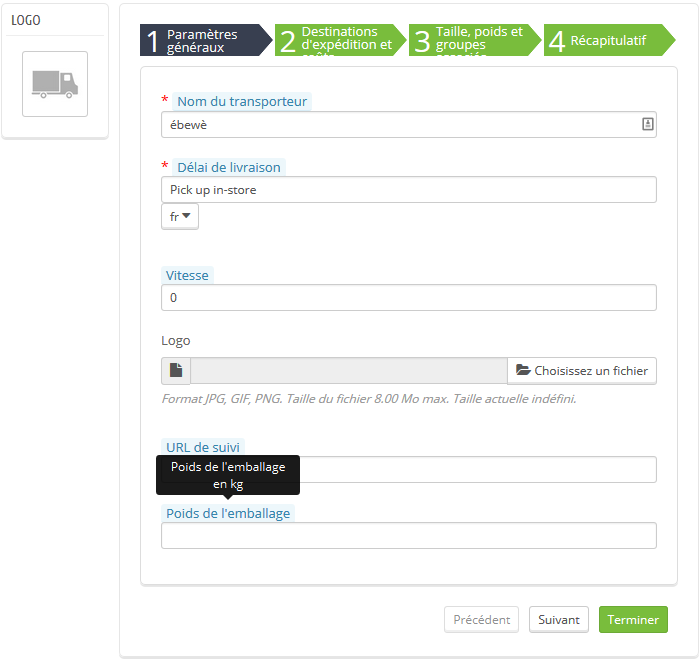

Configuration
=============

Il n'existe pas de page de configuration en tant que telle.

Pour renseigner un poids d'emballage pour un transporteur, rendez-vous simplement sur la page Livraison > Transporteurs et cliquez sur Modifier pour éditer le transporteur souhaité.

Ajoutez un poids d'emballage
^^^^^^^^^^^^^^^^^^^^^^^^^^^^

Renseignez un poids d'emballage en kilos. (Laissez le champ vide si vous ne souhaitez pas utiliser cette option. Le poids d'emballage sera alors de 0).
Cliquez sur Terminer pour enregistrer vos changements et retourner à la page Transporteurs.

C'est tout ce que vous avez à faire.
Votre poids d'emballage est enregistré pour ce transporteur.
Vous pouvez répéter cette opération pour autant de transporteurs que vous le souhaitez.
