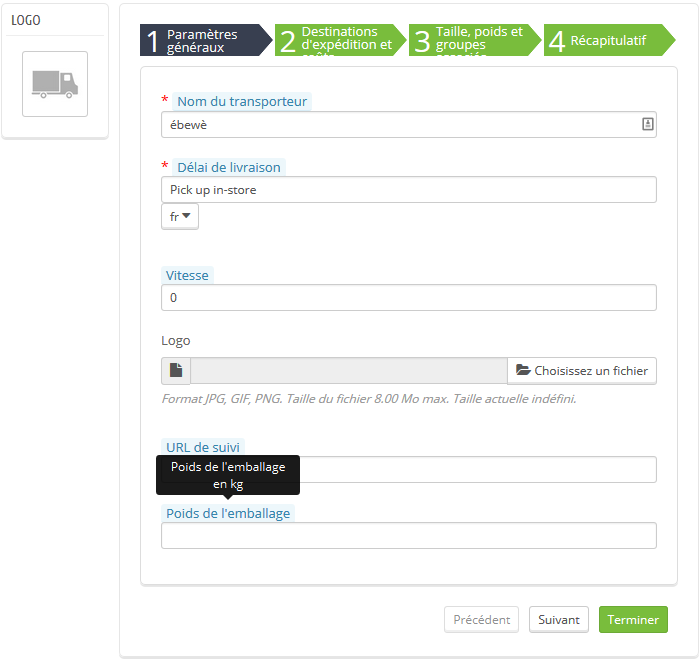

Configuration
=============

There is no actual configuration page.

To enter a package weight for a carrier, simply go to Shipping > Carriers page and click on Modify to edit the carrier you want.

Add a package weight
^^^^^^^^^^^^^^^^^^^^

Enter a Package Weight in kilos. (Leave the field empty if you do not want to use this option. It will set the package weight to 0).
Click on Finish to save your changes and go back to Carriers page.

That's all you need to do.
Your package weight for this carrier is set.
You can do this operation for as many carriers as you want.
